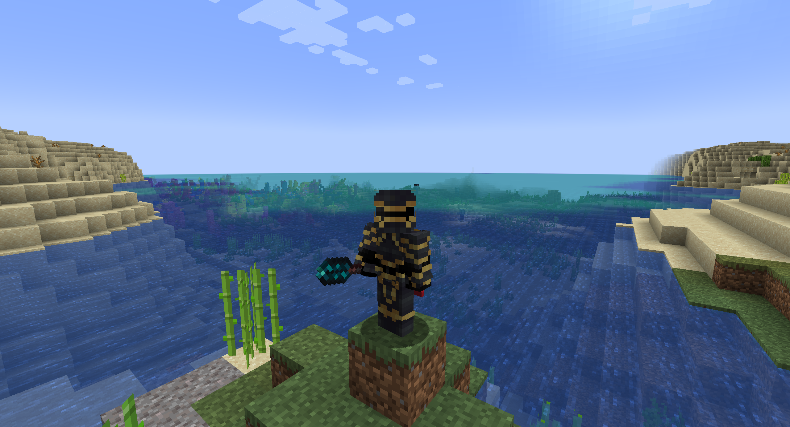

# 

Take control over the flow of time.

Made for [Modfest: Singularity](https://modfest.net/)!

## Getting Started

- Craft the Staff of Relativity
- Use the staff to stop time
- Sneak and use the staff to start time

## Features

- Craftable Staff of Relativity
- Requires op on servers
- Op / cheat keybinds for finer control

## Gallery

## My mods

